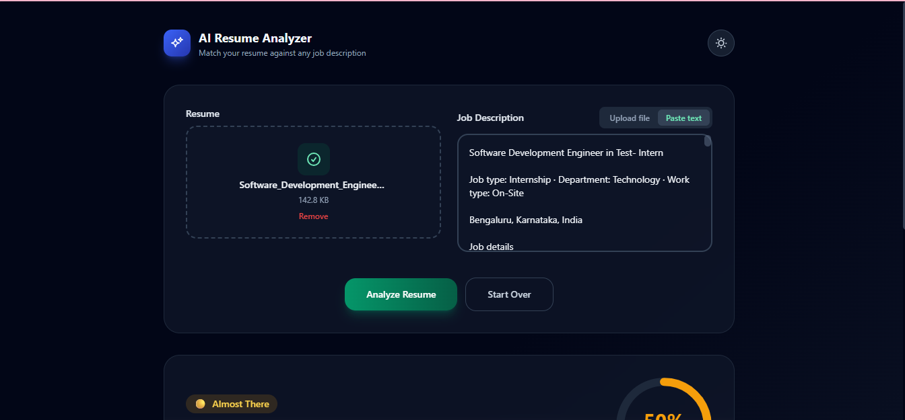
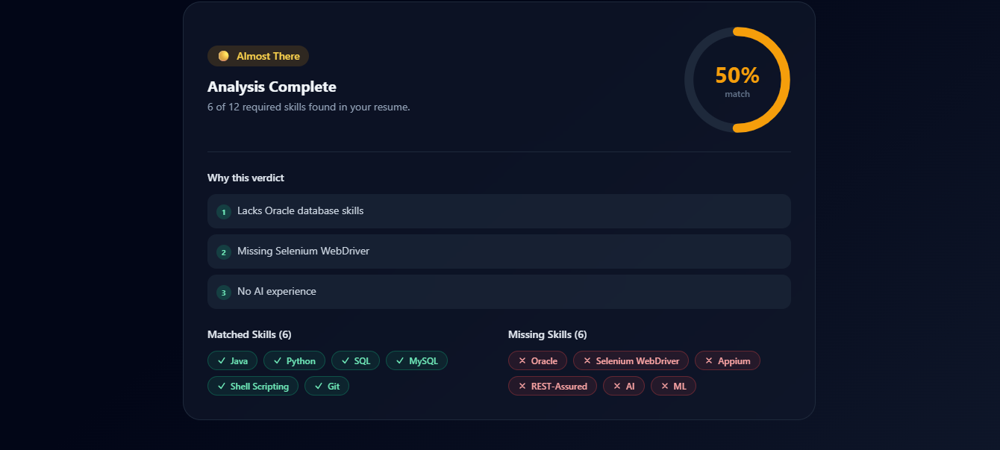

# AI Resume Analyzer

Upload a resume and a job description and get an instant, AI-powered breakdown of matched skills, missing skills, a match percentage, and a hiring verdict with reasons.




## 🚀 Overview

AI Resume Analyzer is a modern web application that helps job seekers optimize their resumes for specific job postings. Using OpenAI's powerful language models, it analyzes resumes against job descriptions to provide actionable insights.

## ✨ Features

- **Drag & Drop Upload** - Support for PDF and DOCX resume files
- **Flexible Job Description Input** - Upload PDF/DOCX/TXT files or paste text directly
- **AI-Powered Analysis** - Two-pass analysis for technical skill extraction and hiring verdict
- **Match Percentage** - Visual score ring showing compatibility with the job
- **Detailed Insights** - Matched skills, missing skills, and personalized reasons
- **Responsive Design** - Modern gradient UI with dark mode toggle
- **Privacy Focused** - Files processed in memory, never stored on disk

## 🛠️ Tech Stack

| Component | Technology |
|-----------|------------|
| **Frontend** | React + Vite, TypeScript, TailwindCSS |
| **Backend** | FastAPI, Python, OpenAI API |
| **File Parsing** | pdfplumber, python-docx |

## 📁 Project Structure

```
AI-Resume-Analyzer/
├── frontend/          # React + Vite + TypeScript + Tailwind app
│   ├── src/
│   ├── public/
│   └── package.json
├── backend/           # FastAPI service
│   ├── main.py
│   ├── ai.py
│   ├── parser.py
│   └── requirements.txt
├── docs/              # Documentation and screenshots
│   ├── screenshot-upload.png
│   └── screenshot-results.png
├── README.md
└── .gitignore
```

## 📋 Prerequisites

- **Node.js** 18+ and npm
- **Python** 3.10+
- **OpenAI API Key** - Get one at [platform.openai.com](https://platform.openai.com/api-keys)

## ⚙️ Setup & Installation

### 1. Backend Setup

```bash
cd backend
python -m venv venv
# Windows:
venv\Scripts\activate
# macOS/Linux:
source venv/bin/activate

pip install -r requirements.txt

# Copy and configure environment variables
cp .env.example .env
# Edit .env and set your OPENAI_API_KEY
```

**Environment Variables (`backend/.env`):**

| Variable | Description | Default |
|----------|-------------|---------|
| `OPENAI_API_KEY` | Your OpenAI API key (required) | — |
| `OPENAI_MODEL` | Model for extraction/verdict | `gpt-4.1-mini` |
| `CORS_ORIGINS` | Allowed frontend origins | `http://localhost:5173,http://127.0.0.1:5173` |
| `MAX_UPLOAD_MB` | Max file size in MB | `10` |

### 2. Frontend Setup

```bash
cd frontend
npm install

# Environment is pre-configured for local development
# VITE_API_BASE_URL=http://localhost:8000
```

## 🚀 Running the Application

### Start the Backend

```bash
cd backend
uvicorn main:app --reload --port 8000
```

API available at `http://localhost:8000` with interactive docs at `http://localhost:8000/docs`

### Start the Frontend

```bash
cd frontend
npm run dev
```

Open `http://localhost:5173` in your browser

## 📖 Usage

1. Drag & drop (or browse to) a resume file — PDF or DOCX
2. Provide a job description via file upload (PDF/DOCX/TXT) or paste text
3. Click **Analyze Resume**
4. Review the match percentage, verdict, matched skills, and missing skills

## 🔌 API Reference

### `POST /analyze`

Analyzes a resume against a job description.

**Request Body (`multipart/form-data`):**

| Field | Type | Required | Notes |
|-------|------|----------|-------|
| `resume` | file | yes | PDF or DOCX |
| `job_description` | file | no* | PDF, DOCX or TXT |
| `job_description_text` | string | no* | Raw pasted text |

*Either `job_description` or `job_description_text` must be provided.

**Success Response (200):**

```json
{
  "matchedSkills": ["React", "TypeScript", "Node.js"],
  "missingSkills": ["GraphQL", "Docker"],
  "matchPercentage": 78,
  "verdict": "Almost There",
  "reasons": [
    "Strong overlap in frontend frameworks like React and TypeScript.",
    "Missing containerization experience with Docker.",
    "No GraphQL experience found, which the role requires."
  ]
}
```

**Error Responses:**
- `400` - Invalid/empty files or missing job description
- `502` - OpenAI API failure or malformed data

## 🏗️ Production Build

```bash
# Frontend
cd frontend
npm run build

# Backend
cd backend
uvicorn main:app --host 0.0.0.0 --port 8000
```

Serve `frontend/dist` with any static host (Vercel, Netlify, Nginx) and configure `VITE_API_BASE_URL` to point to your deployed backend.

## 🔒 Privacy & Security

- All uploaded files are processed in memory and never written to disk
- No data is stored or logged
- Scanned/image-only PDFs without extractable text will return an error (OCR not included)

## 📄 License

MIT License - Feel free to use and modify for your needs.